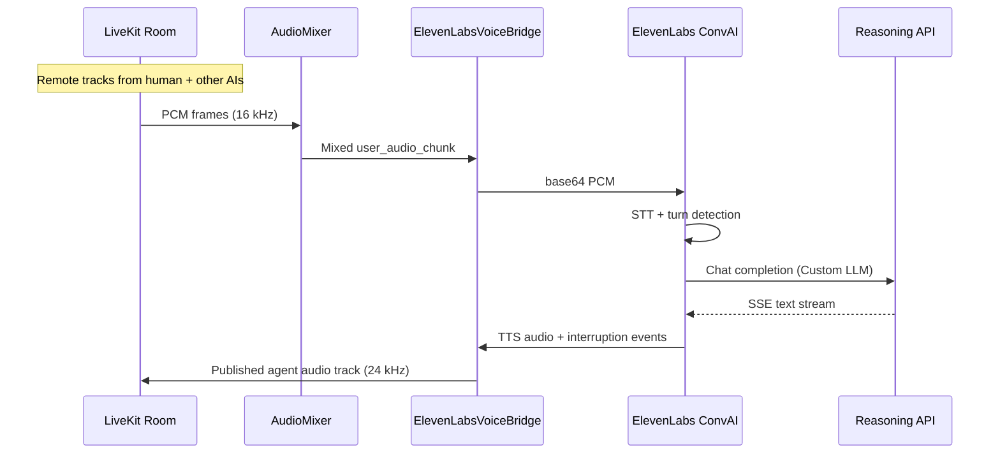

# Architecture — AI Meeting Room POC

## High-level diagram

```mermaid
flowchart TB
    subgraph Clients
        H[Human participant\n(browser / SIP / app)]
    end

    subgraph LiveKit["LiveKit Cloud / Server"]
        R[Room: ai-meeting-room]
        H <-->|WebRTC audio| R
    end

    subgraph Workers["Python backend (×4 independent processes)"]
        W1[Fred worker]
        W2[Missy worker]
        W3[Architect worker]
        W4[Project Alpha worker]
    end

    subgraph PerWorker["Each worker"]
        LKP[LiveKitParticipant adapter]
        MIX[AudioMixer\n(all remote tracks except self)]
        VB[ElevenLabsVoiceBridge]
        MEM[AgentMemory]
        LKP --> MIX --> VB
        MEM -.-> REA
    end

    subgraph ElevenLabs["ElevenLabs Conversational AI"]
        EL1[ConvAI agent — Fred]
        EL2[ConvAI agent — Missy]
        EL3[ConvAI agent — Architect]
        EL4[ConvAI agent — Project Alpha]
    end

    subgraph Reasoning["Reasoning layer (provider-agnostic)"]
        API[Custom LLM API\n/v1/chat/completions]
        ADP{ReasoningAdapter}
        MOCK[MockAdapter]
        OAI[OpenAIAdapter\n(Codex / GPT)]
        CLAUDE[ClaudeAdapter\n(future)]
        GEM[GeminiAdapter\n(future)]
        HYP[HyperAgentAdapter\n(future)]
        API --> ADP
        ADP --> MOCK & OAI & CLAUDE & GEM & HYP
    end

    subgraph Secrets["Secrets"]
        BR[BaserowSecretsAdapter]
        ENV[EnvSecretsAdapter]
        BR --> CHAIN[ChainedSecretsAdapter]
        ENV --> CHAIN
    end

    R <-->|WebRTC| W1 & W2 & W3 & W4
    VB <-->|ConvAI WebSocket\n(STT / TTS / turn / interrupt)| EL1 & EL2 & EL3 & EL4
    EL1 & EL2 & EL3 & EL4 -->|Custom LLM SSE| API
    CHAIN -->|elevenlabs langley halls| VB

    W1 --- PerWorker
    W2 --- PerWorker
    W3 --- PerWorker
    W4 --- PerWorker
```

## Audio flow (one AI participant)



## Adapter boundaries

| Layer | Responsibility | Default implementation | Swappable via |
|-------|----------------|------------------------|---------------|
| **Secrets** | API key lookup | Baserow table → env fallback | `SecretsAdapter` |
| **Room** | Join room, subscribe, mix audio, publish TTS | `LiveKitParticipant` | `RoomAdapter` (future) |
| **Voice** | Bidirectional ConvAI WebSocket | `ElevenLabsVoiceBridge` | `VoiceAdapter` |
| **Reasoning** | System prompt + memory → text | `MockReasoningAdapter` / `OpenAIReasoningAdapter` | `ReasoningAdapter` |
| **Memory** | Per-agent transcript store | `AgentMemory` | Redis / vector store later |

## Participant model

Each AI agent is **fully independent**:

| Agent | LiveKit identity | System prompt focus |
|-------|------------------|---------------------|
| Fred | `ai-fred` | Coordination, summaries |
| Missy | `ai-missy` | Creative strategy |
| Architect | `ai-architect` | Systems design |
| Project Alpha | `ai-project-alpha` | Product goals / priorities |

- Each runs its own **LiveKit connection** and **ElevenLabs signed URL session**.
- Each **mixes all other participants' audio** (human + other agents) via `rtc.AudioMixer`.
- Each **excludes its own published track** to avoid feedback loops.
- ElevenLabs handles **when to speak** and **interruption** (`interruption` → `AudioSource.clear_queue()`).

## Why Custom LLM + ElevenLabs ConvAI

ElevenLabs ConvAI owns the voice stack (ASR, TTS, VAD, turn-taking). The **Custom LLM** endpoint keeps reasoning provider-agnostic: any backend that speaks OpenAI Chat Completions SSE can plug in without changing LiveKit or ElevenLabs voice code.

## Deployment topology (POC)

```
┌─────────────────────────────────────────┐
│  Process 1: reasoning-api (port 8090) │
│  Process 2: main run (4 asyncio tasks)  │
│  Optional: ngrok / tunnel for Custom LLM│
└─────────────────────────────────────────┘
```

Production would split into **one worker process per agent** for isolation and horizontal scale (LiveKit dispatch pattern).

## Non-goals (POC)

- Custom WebRTC / SIP media servers
- Shared single-session multi-speaker LLM context (each agent has own memory + ConvAI session)
- Persistent memory / vector RAG
- Agent-to-agent tool calling

These are covered in the phased implementation plan.
